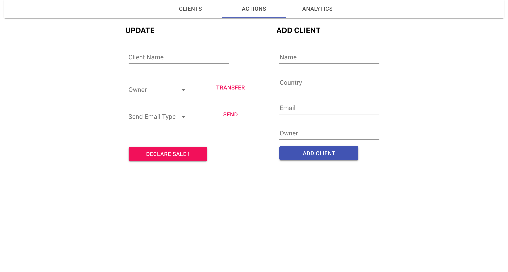

# CRM Web Application
- This project was bootstrapped with [Create React App](https://github.com/facebook/create-react-app),
- adding on to it express-MySQL server.

## General description
- CRM web application.
- Node.js server serving React.Js app. 
- UI by [Material-UI](https://material-ui.com/).

## Mock data.
- Look at data.json.
- Set up your MySQL DB using the files in the server/setup directory.

## Production deployment / production-like env.
- In order to serve React app through the server uncomment specified line in server.js.

## Starting the server 
- Run `node server/server.js`.

## Start
- Run `yarn start` on a separate terminal tab than the server's.
- Runs the app in the development mode. 
- Open [http://localhost:3000](http://localhost:3000) to view it in the browser.

- The page will reload if you make edits. 
- You will also see any lint errors in the console.

## App screenshots
<h1 align="center">
    
    
    
</h1>

## Roadmap
- Completing Add Client and Update Client functionality.
- Toggle dark mode button.
- Adding snackbar messages.
- Implementing Sequelize models.

